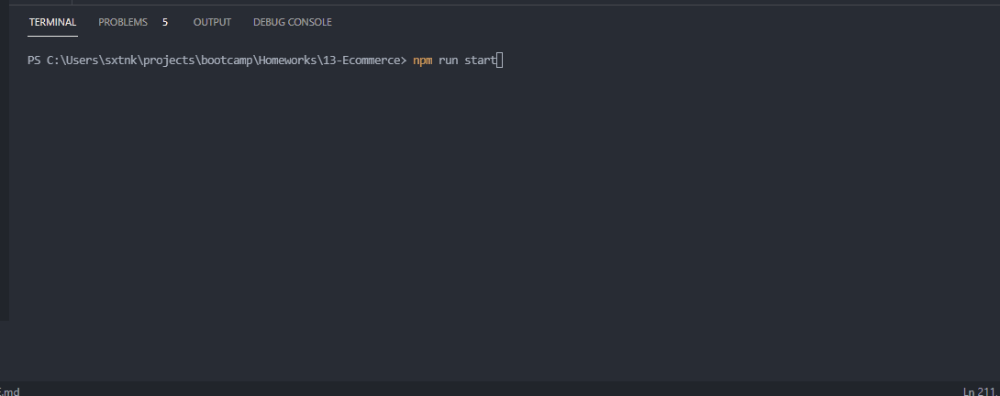
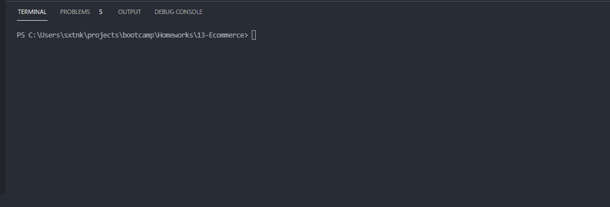
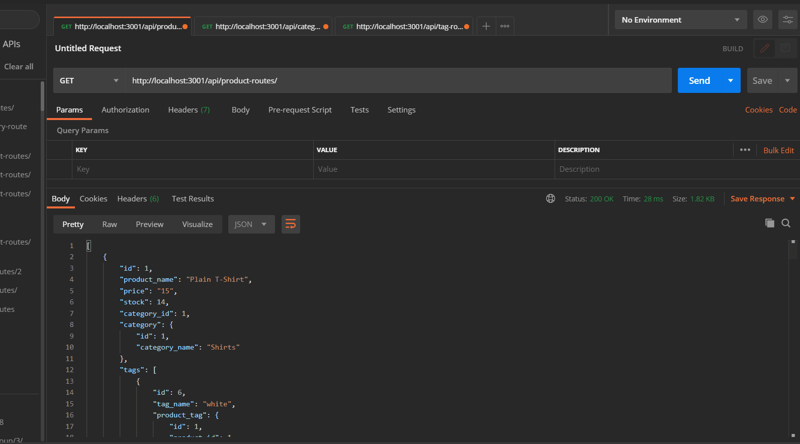
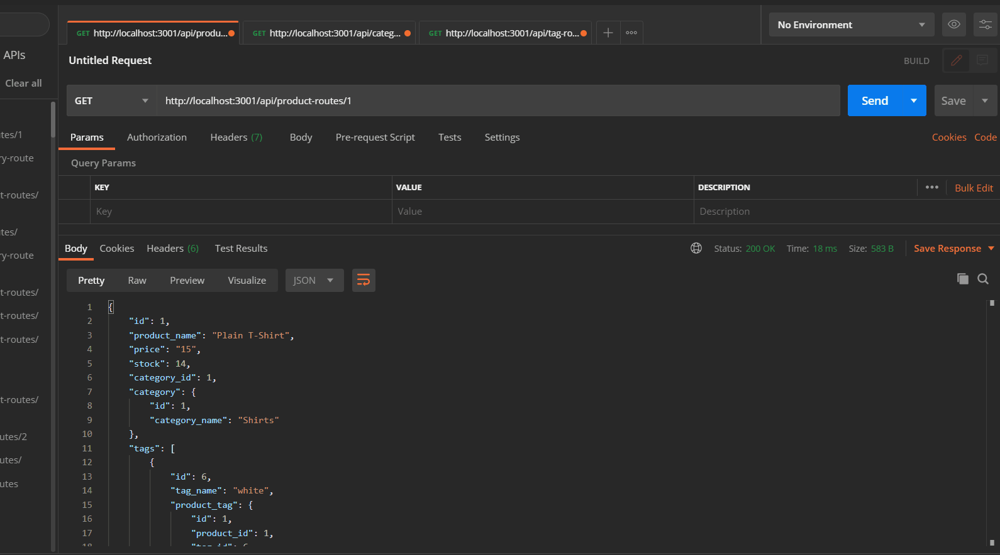
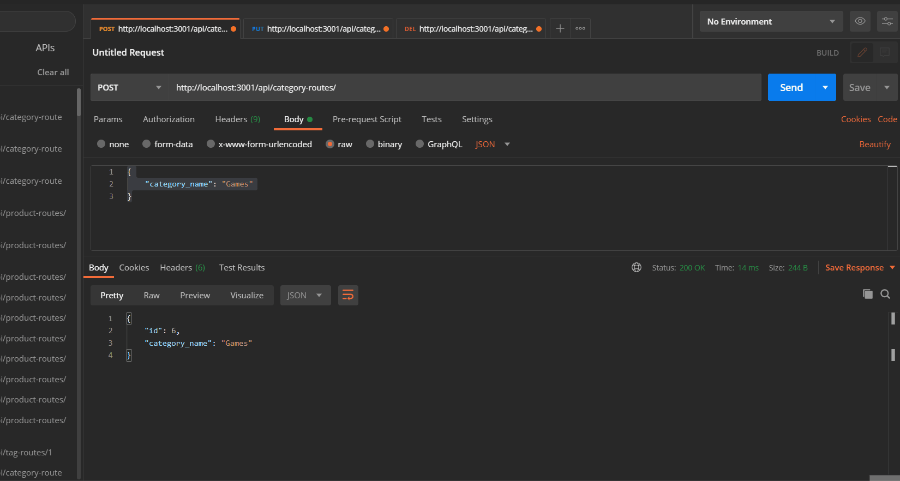
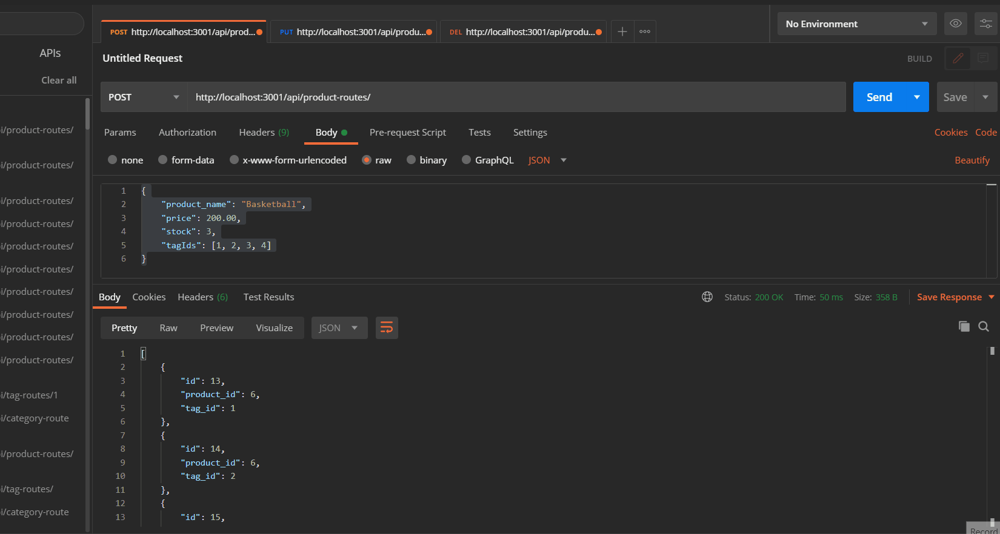
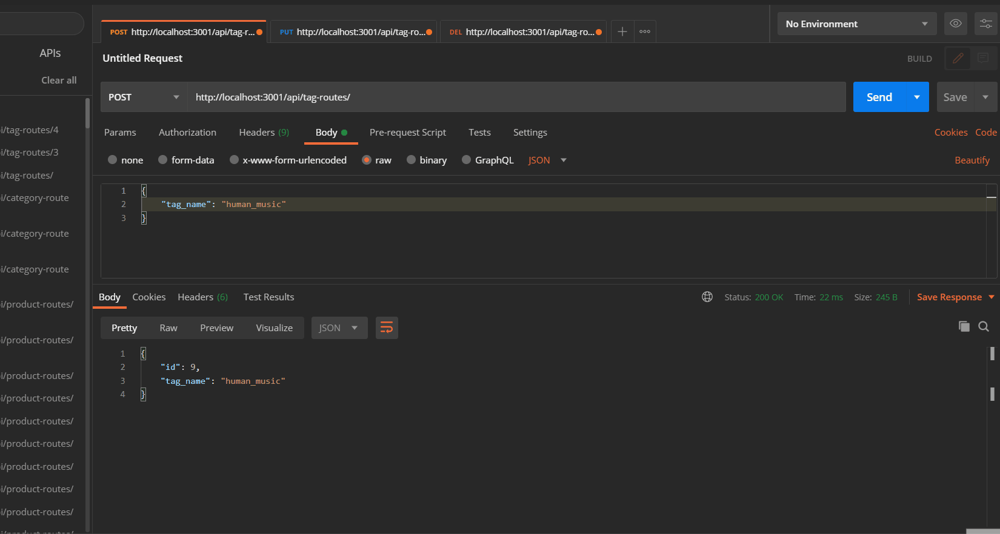

# 13 ORM: E-commerce Site

Homework which requires you to make a backend service for an e-commerce application. This app runs with MySQL and express js.

- First update the .env file with your db info

- Seed the database with

```sh
npm run seed
```

- Start the Server with

```sh
npm run start
```

Technical challenges include:

- Running express servers
- ORM Sequelize for MySQL
- API Routing
- route error handling
- Relational Models
- Database Seeding

server startup:

seeding db:

get requests on all routes:

gets for single ids:

Category POST, PUT, DELETE:

Product POST, PUT, DELETE:

Tag POST, PUT, DELETE:

